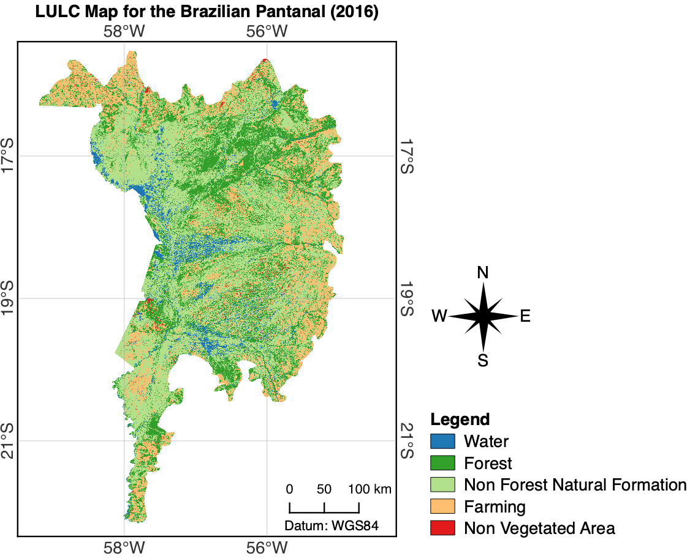

 # Pantanal Land Use Land Cover Mapping with LSTM and Landsat-8/OLI Time Series

 Jupyter notebooks and final map for the Land Use Land Cover mapping of Brazilian Pantanal.

Files:

+ ```Gap Filling CubicSpline.ipynb```
    + Jupyter notebook containing the scripts used to fill the gaps caused by cloud and cloud shadows in Landsat-8/OLI imagery. The method interpolates the missing values with a CubicSpline temporal function.
+ ```Train LSTM tenfold.ipynb```
    + Jupyter notebook containing a tenfold cross validation rpocess that trains 5 different models using raw or filled time series samples.
+ ```Predict suing LSTM trained model.ipynb```
    + Jupyter notebook containing the script used to employ a trained model to predict over data for the whole Pantanal.
+ ```Pantanal_LULC.tif```
    + The final pantanal LULC classfication. Class codes:
        + 1 - Water
        + 2 - Forest
        + 3 - Non Forest Natural Formation
        + 4 - Farming
        + 5 - Non Vegetated Areas

